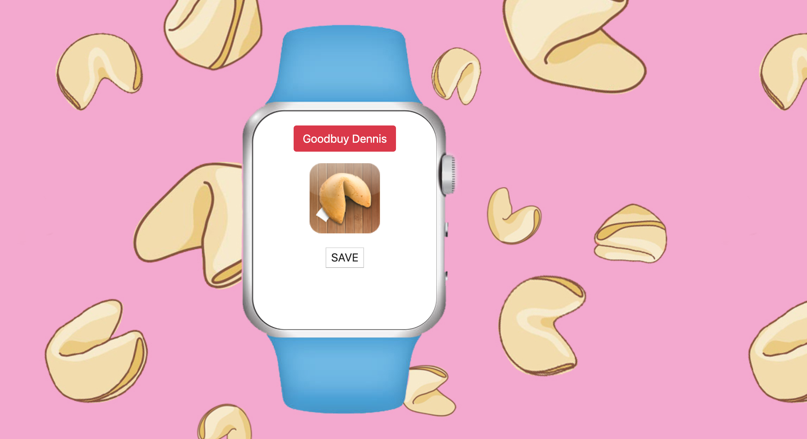
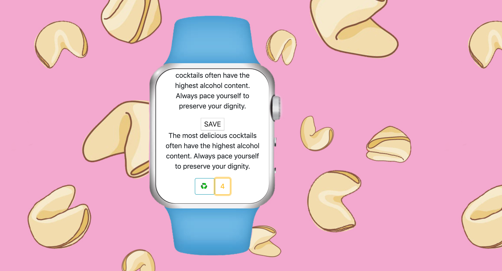

## Cookie Rama `Updated 10.25.2019`

This is a small and powerful app, that will guide you through dark waters of complicated decisions. Just with one tuch you can ask an advice and recive a message from fortune cookie teller. Short but inspirational quote will make your day.      

### `Goals of this project`

1. Master DOM manipulation and Master Rails.
2. Build a simple and concise app with responsive design.
3. Work with external API.

### `Tech stack`

1. Front-end is build with React. First back-end is build with Rails (auth, users, content), second back-end is build with Express (donate).
2. React components styled with a [Material-UI](https://material-ui.com).
3. [EmailJS](https://www.emailjs.com/) for sending greeting mail to every new user.
4. With [Stripe](https://stripe.com/) visitors of the page can donate.

### `Run this App`

1. Rails part should run on http://localhost:3003 (for custom port use this -> "bundle exec puma -C config/puma.rb -b tcp://127.0.0.1:3003")
2. Rails part built on top of PostgreSQL.

### ` What you can do with Cookie Rama app?`

1. Register as a new user. 
2. Existing users log-in only with a username. 
3. Every user can ask for new fortune cookie quote, save it to favourites, update list of favourites quotes, like any number times any number of cookies. 

### `Thanks`

Thank you [Annie Souza](https://github.com/luanesouza), [Randy Herasme](https://github.com/randyher) and [Graham Troyer-Joy](https://github.com/telegraham) for support, professionalism and patience. Thank you for seeing me and every student as a partner in learning and sharing. 
